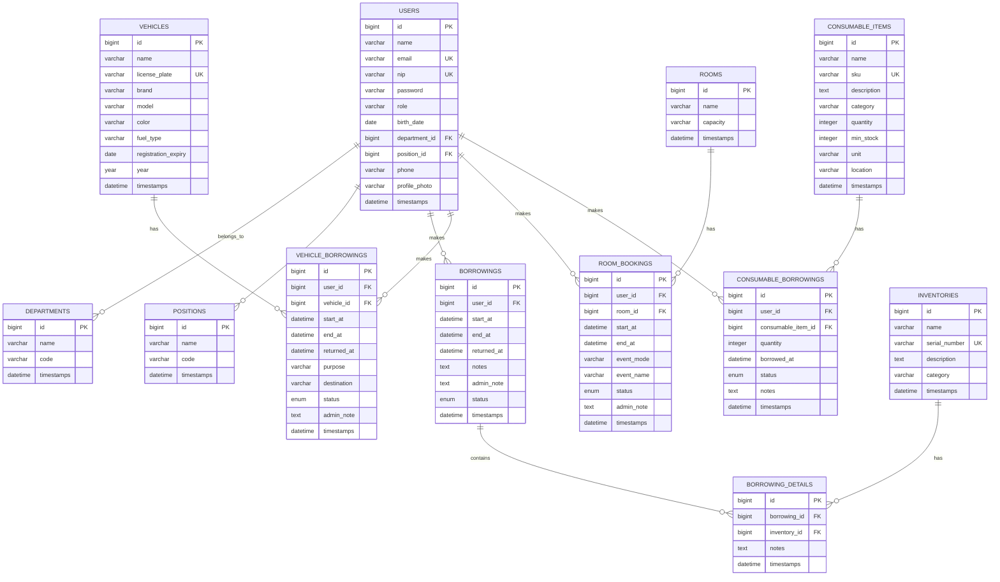

# Entity Relationship Diagram (ERD) - DJPB Inzil App

## Overview

This document describes the database schema and entity relationships for the DJPB Inzil Application, a resource management system that handles:
- User management with departments and positions
- Room booking system
- Vehicle borrowing system
- Inventory/Asset borrowing system
- Consumable items management

---

## Entity-Relationship Diagram (Mermaid)

---

## Table Specifications

### 1. Users (`users`)

Stores application user accounts with role-based access.

| Column | Type | Constraints | Description |
|--------|------|-------------|-------------|
| id | BIGINT | PRIMARY KEY, AUTO_INCREMENT | Unique identifier |
| name | VARCHAR(255) | NOT NULL | User's full name |
| email | VARCHAR(255) | UNIQUE, NOT NULL | User's email address |
| email_verified_at | TIMESTAMP | NULLABLE | Email verification timestamp |
| nip | VARCHAR(255) | UNIQUE, NULLABLE | Employee ID number |
| password | VARCHAR(255) | NOT NULL | Hashed password |
| role | VARCHAR(255) | DEFAULT 'user' | User role (admin/user) |
| birth_date | DATE | NULLABLE | User's birth date |
| position_id | BIGINT | FOREIGN KEY, NULLABLE | Reference to positions |
| department_id | BIGINT | FOREIGN KEY, NULLABLE | Reference to departments |
| phone | VARCHAR(255) | NULLABLE | Phone number |
| profile_photo | VARCHAR(255) | NULLABLE | Profile photo path |
| remember_token | VARCHAR(100) | NULLABLE | Session remember token |
| created_at | TIMESTAMP | NULLABLE | Record creation timestamp |
| updated_at | TIMESTAMP | NULLABLE | Record update timestamp |

**Relationships:**
- Belongs to: `departments`, `positions`
- Has many: `borrowings`, `vehicle_borrowings`, `room_bookings`, `consumable_borrowings`

---

### 2. Departments (`departments`)

Organizational departments for user categorization.

| Column | Type | Constraints | Description |
|--------|------|-------------|-------------|
| id | BIGINT | PRIMARY KEY, AUTO_INCREMENT | Unique identifier |
| name | VARCHAR(255) | NOT NULL | Department name |
| code | VARCHAR(255) | NOT NULL | Department code |
| created_at | TIMESTAMP | NULLABLE | Record creation timestamp |
| updated_at | TIMESTAMP | NULLABLE | Record update timestamp |

**Relationships:**
- Has many: `users`

---

### 3. Positions (`positions`)

Job positions for user categorization.

| Column | Type | Constraints | Description |
|--------|------|-------------|-------------|
| id | BIGINT | PRIMARY KEY, AUTO_INCREMENT | Unique identifier |
| name | VARCHAR(255) | NOT NULL | Position name |
| code | VARCHAR(255) | NOT NULL | Position code |
| created_at | TIMESTAMP | NULLABLE | Record creation timestamp |
| updated_at | TIMESTAMP | NULLABLE | Record update timestamp |

**Relationships:**
- Has many: `users`

---

### 4. Vehicles (`vehicles`)

Fleet vehicles available for borrowing.

| Column | Type | Constraints | Description |
|--------|------|-------------|-------------|
| id | BIGINT | PRIMARY KEY, AUTO_INCREMENT | Unique identifier |
| name | VARCHAR(255) | NOT NULL | Vehicle name |
| license_plate | VARCHAR(255) | UNIQUE, NOT NULL | License plate number |
| brand | VARCHAR(255) | NOT NULL | Vehicle brand |
| model | VARCHAR(255) | NOT NULL | Vehicle model |
| color | VARCHAR(255) | NOT NULL | Vehicle color |
| fuel_type | VARCHAR(255) | NOT NULL | Fuel type (petrol/diesel/electric) |
| registration_expiry | DATE | NOT NULL | Registration expiry date |
| year | YEAR | NOT NULL | Manufacturing year |
| created_at | TIMESTAMP | NULLABLE | Record creation timestamp |
| updated_at | TIMESTAMP | NULLABLE | Record update timestamp |

**Relationships:**
- Has many: `vehicle_borrowings`

---

### 5. Vehicle Borrowings (`vehicle_borrowings`)

Vehicle borrowing requests and records.

| Column | Type | Constraints | Description |
|--------|------|-------------|-------------|
| id | BIGINT | PRIMARY KEY, AUTO_INCREMENT | Unique identifier |
| user_id | BIGINT | FOREIGN KEY, NOT NULL | Reference to users |
| vehicle_id | BIGINT | FOREIGN KEY, NOT NULL | Reference to vehicles |
| start_at | DATETIME | NOT NULL | Borrowing start date/time |
| end_at | DATETIME | NOT NULL | Borrowing end date/time |
| returned_at | DATETIME | NULLABLE | Actual return date/time |
| purpose | VARCHAR(255) | NOT NULL | Purpose of borrowing |
| destination | VARCHAR(255) | NOT NULL | Destination |
| status | ENUM | NOT NULL | pending/approved/ongoing/finished/rejected/canceled |
| admin_note | TEXT | NULLABLE | Admin notes/approval notes |
| created_at | TIMESTAMP | NULLABLE | Record creation timestamp |
| updated_at | TIMESTAMP | NULLABLE | Record update timestamp |

**Relationships:**
- Belongs to: `users`, `vehicles`

---

### 6. Rooms (`rooms`)

Meeting rooms and spaces available for booking.

| Column | Type | Constraints | Description |
|--------|------|-------------|-------------|
| id | BIGINT | PRIMARY KEY, AUTO_INCREMENT | Unique identifier |
| name | VARCHAR(255) | NOT NULL | Room name |
| capacity | VARCHAR(255) | NOT NULL | Room capacity |
| created_at | TIMESTAMP | NULLABLE | Record creation timestamp |
| updated_at | TIMESTAMP | NULLABLE | Record update timestamp |

**Relationships:**
- Has many: `room_bookings`

---

### 7. Room Bookings (`room_bookings`)

Room booking requests and records.

| Column | Type | Constraints | Description |
|--------|------|-------------|-------------|
| id | BIGINT | PRIMARY KEY, AUTO_INCREMENT | Unique identifier |
| user_id | BIGINT | FOREIGN KEY, NOT NULL | Reference to users |
| room_id | BIGINT | FOREIGN KEY, NOT NULL | Reference to rooms |
| start_at | DATETIME | NOT NULL | Booking start date/time |
| end_at | DATETIME | NOT NULL | Booking end date/time |
| event_mode | VARCHAR(255) | NOT NULL | Event mode (online/offline/hybrid) |
| event_name | VARCHAR(255) | NOT NULL | Event/meeting name |
| status | ENUM | NOT NULL | pending/approved/ongoing/finished/rejected/canceled |
| admin_note | TEXT | NULLABLE | Admin notes/approval notes |
| created_at | TIMESTAMP | NULLABLE | Record creation timestamp |
| updated_at | TIMESTAMP | NULLABLE | Record update timestamp |

**Relationships:**
- Belongs to: `users`, `rooms`

---

### 8. Inventories (`inventories`)

Assets and inventory items available for borrowing.

| Column | Type | Constraints | Description |
|--------|------|-------------|-------------|
| id | BIGINT | PRIMARY KEY, AUTO_INCREMENT | Unique identifier |
| name | VARCHAR(255) | NOT NULL | Item name |
| serial_number | VARCHAR(255) | UNIQUE, NULLABLE | Serial number |
| description | TEXT | NULLABLE | Item description |
| category | VARCHAR(255) | NULLABLE | Item category |
| created_at | TIMESTAMP | NULLABLE | Record creation timestamp |
| updated_at | TIMESTAMP | NULLABLE | Record update timestamp |

**Relationships:**
- Has many: `borrowing_details`

---

### 9. Borrowings (`borrowings`)

Inventory borrowing requests (header table).

| Column | Type | Constraints | Description |
|--------|------|-------------|-------------|
| id | BIGINT | PRIMARY KEY, AUTO_INCREMENT | Unique identifier |
| user_id | BIGINT | FOREIGN KEY, NOT NULL | Reference to users |
| start_at | DATETIME | NOT NULL | Borrowing start date/time |
| end_at | DATETIME | NULLABLE | Borrowing end date/time |
| returned_at | DATETIME | NULLABLE | Actual return date/time |
| notes | TEXT | NULLABLE | User notes |
| admin_note | TEXT | NULLABLE | Admin notes |
| status | ENUM | NOT NULL | pending/approved/ongoing/finished/rejected/canceled |
| created_at | TIMESTAMP | NULLABLE | Record creation timestamp |
| updated_at | TIMESTAMP | NULLABLE | Record update timestamp |

**Relationships:**
- Belongs to: `users`
- Has many: `borrowing_details`

---

### 10. Borrowing Details (`borrowing_details`)

Individual inventory items in a borrowing request.

| Column | Type | Constraints | Description |
|--------|------|-------------|-------------|
| id | BIGINT | PRIMARY KEY, AUTO_INCREMENT | Unique identifier |
| borrowing_id | BIGINT | FOREIGN KEY, NOT NULL | Reference to borrowings |
| inventory_id | BIGINT | FOREIGN KEY, NOT NULL | Reference to inventories |
| notes | TEXT | NULLABLE | Item-specific notes |
| created_at | TIMESTAMP | NULLABLE | Record creation timestamp |
| updated_at | TIMESTAMP | NULLABLE | Record update timestamp |

**Unique Constraints:**
- Composite unique: `(borrowing_id, inventory_id)`

**Relationships:**
- Belongs to: `borrowings`, `inventories`

---

### 11. Consumable Items (`consumable_items`)

Consumable supplies with stock tracking.

| Column | Type | Constraints | Description |
|--------|------|-------------|-------------|
| id | BIGINT | PRIMARY KEY, AUTO_INCREMENT | Unique identifier |
| name | VARCHAR(255) | NOT NULL | Item name |
| sku | VARCHAR(255) | UNIQUE, NULLABLE | Stock keeping unit |
| description | TEXT | NULLABLE | Item description |
| category | VARCHAR(255) | NULLABLE | Item category |
| quantity | INTEGER | DEFAULT 0 | Current stock quantity |
| min_stock | INTEGER | DEFAULT 0 | Minimum stock threshold |
| unit | VARCHAR(255) | DEFAULT 'pcs' | Unit of measure |
| location | VARCHAR(255) | NULLABLE | Storage location |
| created_at | TIMESTAMP | NULLABLE | Record creation timestamp |
| updated_at | TIMESTAMP | NULLABLE | Record update timestamp |

**Relationships:**
- Has many: `consumable_borrowings`

---

### 12. Consumable Borrowings (`consumable_borrowings`)

Consumable item borrowing records.

| Column | Type | Constraints | Description |
|--------|------|-------------|-------------|
| id | BIGINT | PRIMARY KEY, AUTO_INCREMENT | Unique identifier |
| user_id | BIGINT | FOREIGN KEY, NOT NULL | Reference to users |
| consumable_item_id | BIGINT | FOREIGN KEY, NOT NULL | Reference to consumable_items |
| quantity | INTEGER | NOT NULL | Quantity borrowed |
| borrowed_at | DATETIME | NOT NULL | Borrowing date/time |
| status | ENUM | NOT NULL | pending/finished/rejected/canceled |
| notes | TEXT | NULLABLE | Borrowing notes |
| created_at | TIMESTAMP | NULLABLE | Record creation timestamp |
| updated_at | TIMESTAMP | NULLABLE | Record update timestamp |

**Relationships:**
- Belongs to: `users`, `consumable_items`

---

## Relationship Summary

### One-to-Many Relationships

| Parent Table | Child Table | Description |
|--------------|-------------|-------------|
| `departments` | `users` | A department has many users |
| `positions` | `users` | A position has many users |
| `users` | `borrowings` | A user can make many borrowings |
| `users` | `vehicle_borrowings` | A user can borrow vehicles multiple times |
| `users` | `room_bookings` | A user can book rooms multiple times |
| `users` | `consumable_borrowings` | A user can borrow consumables multiple times |
| `vehicles` | `vehicle_borrowings` | A vehicle can be borrowed multiple times |
| `rooms` | `room_bookings` | A room can be booked multiple times |
| `borrowings` | `borrowing_details` | A borrowing can contain multiple items |
| `inventories` | `borrowing_details` | An inventory item can be in many borrowings |
| `consumable_items` | `consumable_borrowings` | A consumable item can be borrowed multiple times |

### Many-to-Many Relationships (via Junction Tables)

| Table 1 | Junction Table | Table 2 | Description |
|---------|----------------|---------|-------------|
| `borrowings` | `borrowing_details` | `inventories` | Users can borrow multiple inventory items in one borrowing request |

---

## Business Logic Notes

### Status Enums

**Vehicle Borrowings, Room Bookings, Borrowings:**
- `pending` - Awaiting admin approval
- `approved` - Approved by admin
- `ongoing` - Currently in use
- `finished` - Returned/completed
- `rejected` - Rejected by admin
- `canceled` - Canceled by user

**Consumable Borrowings:**
- `pending` - Awaiting approval
- `finished` - Completed
- `rejected` - Rejected by admin
- `canceled` - Canceled (stock restored)

### Key Features

1. **Availability Checking**: Vehicles, rooms, and inventory items support availability checking for date ranges to prevent double-booking.

2. **Stock Management**: 
   - `consumable_items` - Quantity decreases immediately on borrowing
   - `inventories` - Tracked via borrowing relationships (non-consumable)

3. **Cascade Deletes**: Most foreign keys are set to cascade on delete to maintain referential integrity.

4. **Search & Filter**: Most borrowing models support searchable and filterable columns for admin dashboards.

---

## Diagram Legend

- **PK** = Primary Key
- **UK** = Unique Key
- **FK** = Foreign Key
- **| |** = One (mandatory)
- **o {** = Many (optional)

---

*Generated for DJPB Inzil App - Resource Management System*
